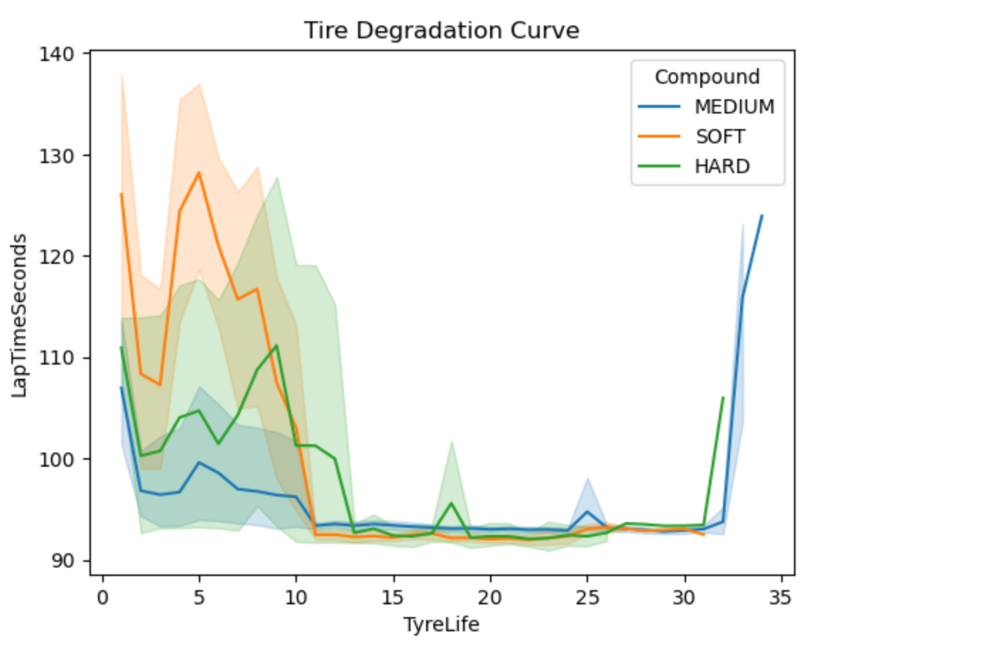
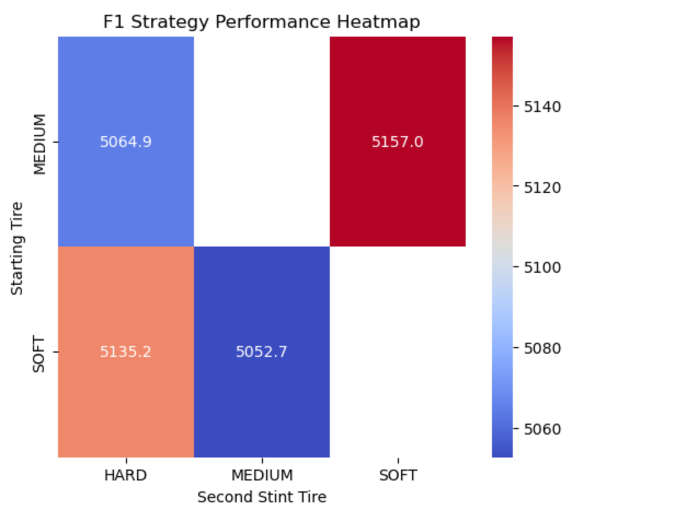

## 🏎️  Formula 1 Race Strategy Recommendation Engine

This project analyzes Formula 1 race telemetry data and builds a strategy recommendation system to identify optimal pit stop strategies.

_Which pit stop strategy gives a driver the highest chance of achieving the fastest race time?_

---

## 🔍 The Problem

Formula 1 race outcomes are heavily influenced by pit stop timing and tire strategy. Teams must balance tire degradation, pace, and pit stop time loss to determine the optimal race strategy.

This project analyzes historical Formula 1 telemetry data and uses simulation techniques to identify the most effective pit stop strategies for minimizing total race time.

---
## 💡 Key Findings
| Metric | Value |
|---------|---------|
| Optimal Strategy | Soft → Medium |
| Recommended Pit Lap | ~30 |
| Average Race Time | ~5050 sec |
| Simulation Method | Monte Carlo |
| Main Performance Driver | Tire degradation rate |

## 💡 Insights
- Soft tires provide the fastest initial pace but experience the highest degradation.
- Medium tires offer the best balance between speed and longevity.
- Strategy performance is highly sensitive to pit stop timing.
- Simulations show that pitting around lap 30 consistently produces the lowest average race time.
- Aggressive early-race pace can outweigh degradation costs when paired with a well-timed switch to medium compounds.

---
## 🎯 Business / Racing Recommendation

This recommendation framework demonstrates how telemetry and simulation can be combined to support real-time race strategy decisions.

The simulation indicates that switching from Soft to Medium around lap 30 maximizes overall race performance by combining early-race speed with long-run consistency.

---
## 🔬 Analysis Performed

### Tire Degradation Analysis

Evaluated lap-time changes as tire age increased across Soft, Medium, and Hard compounds.

### Pit Stop Window Analysis

Analyzed historical pit stop timing to identify common strategy windows and their impact on race performance.

### Monte Carlo Simulation

Simulated race outcomes by incorporating:

- Tire degradation effects
- Lap time variability
- Pit stop time penalties
- Random race-condition fluctuations

### Strategy Comparison

Compared multiple strategies including:

- Soft → Medium
- Soft → Hard
- Medium → Hard

Ranked strategies based on simulated total race time.

---

## 📈 Visualizations

## Strategy Performance Heatmap

---
## Tools & Stack

- Python — data processing and simulation
- Pandas — data manipulation
- NumPy — numerical calculations
- Matplotlib — visualizations
- Seaborn — heatmaps and exploratory analysis
- FastF1 API — Formula 1 telemetry and race data

## 🚀 Skills Demonstrated

- Exploratory Data Analysis (EDA)
- Data Visualization
- Monte Carlo Simulation
- Predictive Modeling
- Sports Analytics
- Strategy Optimization
---
## 👨‍💻 Author

Mahitha Kalinathabotla 

[LinkedIn](https://www.linkedin.com/in/mahitha-kalinathabotla)

---
